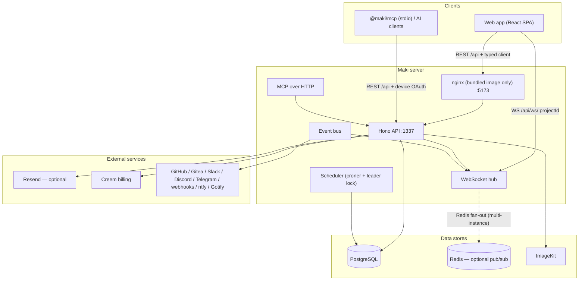

# Maki — System Documentation

This document describes the whole Maki system: what it is, how the pieces fit
together, how data flows through it, and how it is built, tested, and shipped.

It complements the other root docs:

- [`README.md`](README.md) — product introduction and quick start
- [`AGENTS.md`](AGENTS.md) — operating guide for AI agents and contributors
- [`ENVIRONMENT_SETUP.md`](ENVIRONMENT_SETUP.md) — local environment setup and troubleshooting
- [`CONTRIBUTING.md`](CONTRIBUTING.md) — contributing workflow

---

## 1. Overview

Maki is a fast, deliberately simple, self-hosted project-management platform.
The core product lets teams organize work in **workspaces** containing
**projects**, each with **columns** and **tasks** (with labels, comments,
subtasks, relations, time tracking, priorities, and due dates).

The system is built on three durable foundations:

| Foundation | Responsibility |
|---|---|
| **Hono API** (`apps/api`) | Owns all domain behavior and authorization |
| **React web app** (`apps/web`) | Thin consumer of the typed API client |
| **PostgreSQL** | Durable state (via Drizzle ORM) |

Around that core: an internal **event bus** plus **WebSockets** keep clients
current in realtime (Redis is optional and only coordinates broadcast across
multiple API instances), **Better Auth** handles authentication and
workspace/organization roles, and a published **MCP server** lets AI tools
drive the platform.

Design principles (see `AGENTS.md`): simplicity is a product requirement, the
API is the authority for security, self-hosting (single instance) is
first-class, and every mutation must be traced through its realtime surfaces.

---

## 2. High-level architecture



**Request flow (typical mutation):**

1. The web app calls the API through the typed Hono client (`@maki/libs`),
   which adds session credentials and a per-tab `X-Maki-Window-Id`.
2. The API authenticates the request (session cookie, API key, or bearer
   token) and resolves the acting user.
3. Route middleware resolves the workspace from the route params and checks
   the required permission (via `@maki/permissions`).
4. Zod validators (`@hono/zod-openapi`) validate input before the controller
   runs; the controller performs the domain mutation in PostgreSQL.
5. The controller calls `publishEvent()`. Subscribers write the **activity
   log**, create **notifications**, drive **integrations**, and broadcast a
   WebSocket message (batched, initiator excluded).
6. The web client receives the WebSocket message and invalidates the affected
   TanStack Query caches, so the UI converges without a full refetch.

---

## 3. Monorepo layout

pnpm workspace (packages in `packages/**` and `apps/**`), orchestrated by
**Turbo**.

| Path | What it is |
|---|---|
| `apps/api` | Hono API: Better Auth, controllers, database access, events, integrations, MCP HTTP routes, WebSockets, scheduler, billing |
| `apps/web` | React/Vite SPA: TanStack Router + Query, fetchers, hooks, realtime cache updates |
| `apps/docs` | Mintlify documentation content (includes a committed `openapi.json`) |
| `apps/site` | Public Next.js marketing site (blog, guides, alternatives, pricing) |
| `packages/libs` | Shared typed Hono client (`hc<AppType>`) + API URL helpers |
| `packages/permissions` | Canonical permission vocabulary + built-in roles |
| `packages/mcp` | Published stdio MCP server (`@maki/mcp`) |
| `packages/email` | Email templates (password resets, invitations, and notifications) |
| `packages/planka-import` | Standalone Planka → Maki import tool |
| `packages/typescript-config` | Shared TypeScript configs |
| `charts/maki` | Helm chart for Kubernetes deployments |
| `deploy/` | Bundled-image entrypoint script |
| `tests/api` | API unit tests (Vitest) |
| `tests/api-integration` | PostgreSQL-backed integration tests |
| `i18n/` | Locale files (20 languages), `en-US.json` is the source of truth |
| `.github/workflows` | CI/CD pipelines |

---

## 4. Technology stack

| Concern | Choice |
|---|---|
| Language | TypeScript everywhere (API, web, packages, scripts, site) |
| Runtime | Node.js ≥ 24 (CI uses 24.19.0), pnpm 10.32.1 |
| API framework | Hono 4.x + `@hono/zod-openapi` (Zod-validated routes, OpenAPI generation) |
| Auth | Better Auth 1.6.x (email/password sessions, API keys, device authorization, organizations-as-workspaces) |
| Database | PostgreSQL + Drizzle ORM (TS schema, `drizzle-kit` migrations) |
| Realtime | `@hono/node-ws` WebSockets + in-process event bus; optional Redis Pub/Sub (ioredis) for multi-instance fan-out |
| Jobs | croner + a PostgreSQL `job_lease` leader lock |
| Billing | Creem (creem.io) |
| Storage | ImageKit (client-side signed uploads, signed delivery URLs) |
| Web UI | React 19, Vite 8, Tailwind CSS 4, TanStack Router + Query, Radix/Base UI components |
| Editor | TipTap 3 (markdown, code blocks, tables, task lists) |
| Motion / drag & drop | framer-motion, dnd-kit |
| i18n | i18next (web), static JSON locale files |
| Observability | Sentry (opt-in, API + web) |
| MCP | `@modelcontextprotocol/sdk` |
| Monorepo tooling | Turbo, Biome (lint/format), commitlint + husky, esbuild (API bundling) |
| Tests | Vitest + Testing Library (web), Postgres-backed integration tests |

---

## 5. API layer (`apps/api`)

### 5.1 Request pipeline

`createApp()` in `src/index.ts` assembles the Hono app:

1. **CORS** — origins resolved from `MAKI_CLIENT_URL` / `CORS_ORIGINS`
   (credentials allowed, unconfigured origins reflect the request origin in dev).
2. **OpenAPI document** served from `/api/doc` with a `bearerAuth` security scheme.
3. **Public routes** (registered before the auth middleware):
   - `/api/config` — public instance settings (sign-in methods, features)
   - `/api/mcp` — MCP HTTP endpoint (own OAuth/API-key auth)
   - public-project and invitation-accept routes
   - `/api/health` — health check used by containers
4. **App-wide auth middleware** (`api.use("*", authenticateApiRequest)`):
   authenticates via session cookie, API key, or bearer token; runs the request
   inside `eventContext.run({ initiatorId })` (the `X-Maki-Window-Id` header
   becomes part of the initiator identity so a user's own actions can be
   excluded from broadcasts).
5. **Feature routers** mounted under `/api/...` (see below).
6. **WebSocket upgrade routes** `/api/ws/user` and `/api/ws/:projectId`.

### 5.2 Feature module pattern

Every feature follows the same shape, e.g. `src/task/`:

```
feature/
├── index.ts        # createRoute({ method, operationId, path, middleware, request, responses })
├── schema.ts       # Zod request schemas
├── response.ts     # response schemas (named .openapi("Name") → reusable components)
└── controllers/    # thin handlers + domain logic
```

Key conventions:

- Routes are declared with `createRoute` from `@hono/zod-openapi` and mounted on
  `apiRouter()` (`src/openapi.ts`); `HTTPException` is used for expected HTTP failures.
- Route middleware declared via `createRoute({ middleware })` runs **before** the
  request validators, so middleware reads the raw request, not `c.req.valid()`.
- Authorization uses `requireWorkspacePermission` (from `src/utils/require-workspace-permission.ts`)
  combined with `workspaceAccess` middleware that resolves the workspace from
  params (`fromParam`), a project (`fromProject`), or request bodies (`fromTasks`, etc.).
- Controllers publish events with `publishEvent()` when the mutation affects
  activity, notifications, integrations, or realtime state.

### 5.3 API surface

All feature routes mount under `/api`:

| Base path | Feature |
|---|---|
| `/api/auth/*` | Better Auth routes (session, sign-in/up, organization, API keys, device auth) |
| `/api/config` | Public instance config |
| `/api/billing` | Plans, checkout, subscription state |
| `/api/project` | Projects (CRUD, archive, reorder, share/public) |
| `/api/task` | Tasks: board fetch, CRUD, move, assignee/status/priority/due-date/title/description updates, bulk update, import/export, image upload |
| `/api/column` | Columns (CRUD, reorder) |
| `/api/activity` | Activity log (incl. comments, which are activity rows) |
| `/api/comment` | Task comments |
| `/api/time-entry` | Time tracking |
| `/api/label` | Labels (CRUD, assign/unassign) |
| `/api/notification` | In-app notifications |
| `/api/notification-preferences` | Per-user notification preferences |
| `/api/search` | Global + project search |
| `/api/github-integration`, `/api/gitea-integration`, `/api/slack-integration`, `/api/discord-integration`, `/api/telegram-integration`, `/api/generic-webhook-integration` | External integrations |
| `/api/task-relation` | Task dependencies/relations |
| `/api/external-link` | Links synced from external issues |
| `/api/workflow-rule` | Automation rules (integration event → column move) |
| `/api/invitation` | Workspace invitations |
| `/api/workspace` | Workspaces, members, roles |
| `/api/user` | Current user profile/account |
| `/api/mcp` | MCP over HTTP |
| `/api/ws/user`, `/api/ws/:projectId` | WebSockets |
| `/api/health` | Health check |

OpenAPI metadata is exported to `apps/docs/openapi.json` via `pnpm --filter @maki/api openapi:export`.

---

## 6. Authentication & authorization

### 6.1 Better Auth configuration (`src/auth.ts`)

- **Interactive sign-in**: email and password only. The `account` table remains
  part of Better Auth because credential accounts store password hashes there;
  its provider columns do not mean social login is enabled.
- **Password recovery**: Resend-backed reset links create a credential account
  when an older OAuth-only user has none, providing the upgrade path without
  keeping social login enabled.
- **Organizations = workspaces**: the Better Auth organization plugin is
  repurposed as the workspace model (`workspace`/`workspace_member` tables),
  with `workspace_role` rows holding editable role permissions.
- **Dynamic access control**: roles are stored as permission statements in
  `workspace_role`, seeded/backfilled at boot for the default roles
  (`viewer`, `member`, `admin`) — their permission payloads live in
  `@maki/permissions` (`defaultRolePayloads`).
- **API keys**: `@better-auth/api-key` plugin; keys carry their own permission
  scopes and can be enabled/disabled, rate-limited, and refilled.
- **Device flow**: OAuth device authorization for CLI/MCP clients through
  Better Auth (`DEVICE_AUTH_CLIENT_IDS`, defaults `maki-cli`, `maki-mcp`).
- **Hooks**: instance-admin gating, first-user-becomes-admin, registration
  gating (`MAKI_CLOUD` + Turnstile captcha + disposable-email block),
  invitation enforcement, workspace auto-creation, invitation email copy,
  seat-count sync with billing, and deletion cleanup.

### 6.2 Authorization

- The API is the **only** authority for authorization; UI hiding is not a check.
- `@maki/permissions` (`packages/permissions/src/index.ts`) defines the
  canonical vocabulary:

  ```ts
  project:  ["create", "read", "update", "delete", "share"]
  task:     ["create", "read", "update", "delete", "assign"]
  label:    ["create", "read", "update", "delete"]
  workspace:["read", "update", "delete", "manage_settings"]
  ```

  plus Better Auth's default organization/member/team/invitation statements.

- Built-in roles: `viewer` (read-only), `member`, `admin`, `owner`. The first
  three are editable (their permissions live in `workspace_role` rows); `owner`
  is a static Better Auth role.
- `requireWorkspacePermission(workspaceId, "task", "update")`-style helpers are
  used in route handlers; `useWorkspacePermission` mirrors the checks in the UI
  for capability display only.
- Integration secrets (webhook URLs, tokens) are encrypted at rest
  (migration `0026_encrypt_notification_preference_secrets.sql`).

---

## 7. Data model

Drizzle schema lives in `src/database/schema.ts`, relations in
`src/database/relations.ts`. Migrations are generated with
`pnpm --filter @maki/api db:generate` into `drizzle/` (45 migrations so far)
and run automatically at startup (after waiting for the database).

Main entities:

| Domain | Tables |
|---|---|
| Identity (Better Auth) | `user`, `session`, `account`, `verification`, `apikey`, `deviceCode`, `userAvatar` |
| Workspace | `workspace`, `workspaceUser` (members), `workspaceRole`, `team`, `teamMember`, `invitation` |
| Billing | `workspaceBilling`, `trialGrant`, `billingEvent`, `billingReminderSent` |
| Work | `project`, `column`, `task`, `taskRelation`, `label`, `timeEntry`, `externalLink` |
| Activity & notifications | `activity`, `notification`, `userNotificationPreference`, `userNotificationWorkspaceRule`, `userNotificationWorkspaceProject` |
| Realtime ops | `jobLease` (scheduler leader lock), `taskReminderSent` (idempotency) |
| Integrations | `integration` (typed/config JSON: GitHub, Slack, Discord, Telegram, Gitea, generic webhook), `workflowRule` |
| Assets | `asset` (ImageKit file paths + file IDs) |
| MCP OAuth | `mcpOauthState` |

Key behaviors baked into the schema: cascade deletes on workspace/project/task
deletion, `onDelete`/`onUpdate` relations throughout, task numbering via
`project.lastTaskNumber`, archival via `project.archivedAt`, and FKs backed by
supporting indexes (migration `0029`).

---

## 8. Events, WebSockets & realtime

### 8.1 Event bus (`src/events/index.ts`)

An in-process `EventEmitter` with `AsyncLocalStorage` initiator tracking.
Controllers publish with `publishEvent(type, data)`; subscribers (activity,
notifications, integrations, WebSocket hub) consume with `subscribeToEvent`.

Event catalog (published by controllers):

```
comment.created            comment.deleted             comment.updated
mcp.authorization_code_issued
notification.created
task-relation.created      task-relation.deleted       task-relation.refresh
task.assignee_changed      task.created                task.deleted
task.description_changed   task.due_date_changed       task.label_assigned
task.label_created         task.label_deleted          task.label_unassigned
task.moved                 task.priority_changed       task.status_changed
task.title_changed         task.unassigned             task.updated
time-entry.created         workspace.created
```

### 8.2 WebSocket hub (`src/ws/index.ts`)

- **Endpoints**: `/api/ws/:projectId` (project-scoped) and `/api/ws/user`
  (user-scoped, used for `NOTIFICATION_CREATED`).
- **Broadcast batching**: messages to a project are deduplicated and flushed
  every 100 ms through a **BroadcastAdapter**.
- **Adapters**: `InMemoryBroadcastAdapter` (single instance) or
  `RedisBroadcastAdapter` when Redis is configured — enabling multi-instance
  fan-out. Redis modes: standalone (`REDIS_URL`), Sentinel, or Cluster.
- **Initiator exclusion**: the acting user's own window (`userId:windowId`)
  does not receive echoes of its own changes.
- **Message types**: `TASK_UPDATED`, `TASK_CREATED`, `TASK_DELETED`,
  `TASK_LABEL_UPDATED`, `TASK_MOVED`, `TASK_RELATION_UPDATED`,
  `COMMENT_UPDATED`, `NOTIFICATION_CREATED`.

### 8.3 Client side (`apps/web`)

- `useProjectWebSocket` / `useUserWebSocket` connect with the session,
  reconnect with exponential backoff (max 5), and ping every 30 s to survive
  Cloudflare's 100 s idle timeout.
- Incoming messages invalidate the relevant TanStack Query keys
  (`["tasks", projectId]`, `["task", taskId]`, `["labels", taskId]`,
  `["comments", taskId]`, `["activities", taskId]`, `["task-relations", …]`).

---

## 9. Background jobs (`src/scheduler`)

croner-based jobs, guarded by the `job_lease` leader lock so only one API
instance executes them:

| Job | What it does |
|---|---|
| Due-date reminders | Emails/notifications for tasks approaching due date (respects user lead-time preference, idempotent via `taskReminderSent`) |
| Trial reminders | Billing trial end reminders (`billingReminderSent`) |
| Seat reconciliation | Reconciles billed seats with workspace membership |
| Project webhook reminders | Re-triggers project webhooks |

---

## 10. Billing (`src/billing`)

- **Provider**: Creem. Enabled only when `isCloud()` plus `CREEM_API_KEY` and
  `CREEM_WEBHOOK_SECRET` are set (self-hosted instances ship with billing off).
- **Plans**: `personal` and `team`, each monthly or annual, mapped from
  `CREEM_PRODUCT_*` env vars. Test mode via `CREEM_TEST_MODE=true`.
- **Trials**: default 14 days (`BILLING_TRIAL_DAYS`), per-user trial grants,
  optional founding-member free tier (`BILLING_FOUNDING_CUTOFF`).
- **Seats**: workspace seat count drives the subscription; synced on membership
  changes and reconciled by the scheduler and webhooks.
- **Enforcement**: `requireEntitlement` middleware gates bulk operations;
  webhooks update subscription state; billing webhooks are signature-verified.

---

## 11. Notifications (`src/notification`)

- **In-app notifications** stored in `notification`, delivered over the
  user WebSocket.
- **Delivery channels** per user preferences: email (Resend), ntfy, Gotify, and
  generic webhook — with encrypted credentials.
- **Granular rules**: per-workspace activation (`userNotificationWorkspaceRule`)
  with project allowlists (`userNotificationWorkspaceProject`); toggles for
  task assignment, comments, status changes, and due-date reminders with a
  configurable lead time.
- SSRF protection: private-network destinations are blocked unless
  `MAKI_ALLOW_PRIVATE_WEBHOOK_DESTINATIONS=true`.

---

## 12. Activity log (`src/activity`)

`activity` is the durable, user-visible history. Comments are stored as
activity rows of type `comment` (unified table — migration `0032`). The
activity module subscribes to task events (`task.created`, updates, comments,
relations) and writes human-readable entries; `eventData`/`content` fields
carry change details and external-user attribution for imports.

---

## 13. Integrations & workflow rules

| Integration | Mechanism |
|---|---|
| GitHub | GitHub App (webhooks via `@octokit/webhooks`), issue/task sync, labels sync, external links |
| Gitea | Issue import + two-way sync |
| Slack / Discord / Telegram | Event notifications to channels |
| Generic webhook | Outbound JSON webhooks on configured events |
| Workflow rules | `workflowRule` rows: when an integration event fires, move the task to a target column |

All integrations publish/consume the same event bus, so activity,
notifications, and realtime updates stay consistent regardless of source.
`externalLink` rows link tasks to external issues (with metadata); asset and
secret handling is guarded (see `external-link-secrets` integration test).

---

## 14. Storage & assets (`src/storage`)

- **ImageKit** for task images/attachments, configured via
  `IMAGEKIT_PUBLIC_KEY`, `IMAGEKIT_PRIVATE_KEY`, and `IMAGEKIT_URL_ENDPOINT`
  (plus optional `IMAGEKIT_MAX_UPLOAD_BYTES`, `IMAGEKIT_UPLOAD_TTL_SECONDS`).
  The API issues short-lived signed upload tokens; the browser uploads directly
  to ImageKit's upload endpoint; reads stream through `/api/asset/:id` using
  short-lived signed URLs, so files stay private.
- Uploads use **signed ImageKit upload tokens** (browser → ImageKit directly); finalized uploads create `asset` rows with
  workspace/project/task/activity scoping and authorization on read.
- Avatars are stored in the database (`userAvatar`).
- Orphaned assets are cleaned up when comments/tasks are deleted.

---

## 15. Search (`src/search`)

PostgreSQL-based search across tasks and projects (`ILIKE` patterns plus task
short IDs like `#123`). API endpoint `/api/search`; the web app has a search
command menu. No external search engine is required (single-instance friendly).

---

## 16. MCP (`apps/api/src/mcp`, `packages/mcp`)

- **HTTP endpoint** at `/api/mcp` on every instance, supporting OAuth
  (device-flow authorization with `mcpOauthState`) and API keys.
- **stdio package** `@maki/mcp` (`npx -y @maki/mcp`) for local AI clients,
  authenticated via the device flow against a Maki instance.
- The MCP server registers **36 tools** covering: session/workspaces, projects,
  tasks (CRUD, move, status/assignee/due-date updates), comments, labels,
  task relations, activity, time entries, members/columns, search, and
  notifications.
- The bundled-image nginx config proxies `/.well-known/oauth-*` paths so MCP
  clients can discover the OAuth endpoints through the same origin.

---

## 17. Web application (`apps/web`)

### 17.1 Routing (TanStack Router, file-based)

```
/                                  landing/sign-in redirect
/auth/sign-in | sign-up | forgot-password | reset-password
/device | /device/approve          device-flow OAuth approval
/invitation/accept/$inviteId
/mcp/authorize                     MCP OAuth consent
/public-project/$projectId         shared public project
/_layout (command palette + search menu)
  /_authenticated (session guard → redirect to /auth/sign-in)
    /dashboard                     dashboard, invitations, onboarding, profile-setup
    /dashboard/settings            account, projects, workspace (+ nested pages)
    /workspace/create
    /workspace/$workspaceId        workspace home, members, search
      /project/$projectId          board (default), backlog, calendar, gantt
        /task/$taskId              task detail
```

### 17.2 Data layer

- **Typed client**: `@maki/libs` wraps `hc<AppType>` with credentials, JSON
  headers, and a per-tab `X-Maki-Window-Id`; no parallel untyped request layer.
- **Fetchers** in `src/fetchers/<feature>/` — one file per endpoint group.
- **Server state**: TanStack Query hooks in `src/hooks/queries` and
  `src/hooks/mutations`; the shared `query-client` handles network/401/
  cancellation errors, Sentry capture, and retry policy.
- **Local state**: zustand stores (`project`, `bulk-selection`,
  `backlog-bulk-selection`, `user-preferences`).
- **Realtime**: WebSocket hooks invalidate caches on broadcast messages
  (§8.3).

### 17.3 UI

- shadcn-style component kit in `src/components/ui` (Radix UI / Base UI
  primitives, CVA, tailwind-merge), Tailwind CSS 4, Geist fonts.
- Project views: **kanban board** (dnd-kit), **backlog** (list), **calendar**,
  **gantt**, plus a **list view**; task details in a sheet or dedicated page
  with a TipTap rich-text editor (markdown, code with Shiki, tables, task
  lists, images via ImageKit signed uploads).
- Command palette (cmdk), keyboard shortcuts, bulk selection, theme toggle,
  workspace switcher, trial card, error boundaries.

### 17.4 i18n

Static keys only — `i18n/en-US.json` is the source of truth, with 19 translated
locales and an enforced `i18n/schema.json`. Web copy must not hardcode strings.
`pnpm i18n:check` validates parity in CI.

---

## 18. Deployment

### 18.1 Images

| Image | Contents |
|---|---|
| `ghcr.io/usekaneo/kaneo` | **Bundled**: API + web static files + nginx (default for Compose/Coolify) |
| `ghcr.io/usekaneo/api` | API only |
| `ghcr.io/usekaneo/web` | Web only (static, nginx) |

The bundled image (`Dockerfile.maki`) runs `deploy/maki-entrypoint.sh`:

1. Derives `MAKI_API_URL` from `MAKI_CLIENT_URL` when unset.
2. Derives `DATABASE_URL` from `POSTGRES_*` vars when unset (fails fast if
   neither is present).
3. Auto-generates a session `AUTH_SECRET` when unset (with a warning).
4. Runs `env.sh` to swap runtime placeholders (`MAKI_TURNSTILE_SITE_KEY`,
   `MAKI_SENTRY_DSN`) in the baked web bundle.
5. Starts the API on `:1337`, waits for `/api/health`, then serves nginx on
   `:5173` proxying `/api/`, `/ws/`, and the MCP OAuth `/.well-known/` paths.

### 18.2 Options

- **Docker Compose** (`compose.yml`) — Postgres 16 + bundled image; optional
  Redis (Valkey) for HA.
- **Coolify** (`compose.coolify.yml`) — public-repo Docker Compose build pack.
- **Kubernetes** — Helm chart in `charts/maki` (values for TLS, Redis,
  storage, replicas).
- **drim CLI** — one-shot installer for straightforward deployments.

---

## 19. Configuration

Single root `.env` shared by API and web (local Vite-only overrides live in
`apps/web/.env.local`). See `ENVIRONMENT_SETUP.md` and the docs site for the
full list. Key groups:

| Group | Variables |
|---|---|
| Core | `MAKI_CLIENT_URL`, `MAKI_API_URL`, `AUTH_SECRET`, `DATABASE_URL` (or `POSTGRES_*`), `CORS_ORIGINS` |
| Resend | `RESEND_API_KEY`, `RESEND_FROM` |
| ImageKit | `IMAGEKIT_PUBLIC_KEY`, `IMAGEKIT_PRIVATE_KEY`, `IMAGEKIT_URL_ENDPOINT` |
| Redis | `REDIS_URL` (standalone) / `REDIS_SENTINELS`+`REDIS_SENTINEL_MASTER_NAME` / `REDIS_CLUSTER_NODES` |
| Billing | `CREEM_API_KEY`, `CREEM_WEBHOOK_SECRET`, `CREEM_PRODUCT_*`, `BILLING_TRIAL_DAYS`, `BILLING_FOUNDING_CUTOFF` |
| Cloud gates | `MAKI_CLOUD`, `TURNSTILE_SECRET_KEY`, `MAKI_TURNSTILE_SITE_KEY` |
| Device auth | `DEVICE_AUTH_CLIENT_IDS` (defaults `maki-cli`, `maki-mcp`) |
| MCP | `MAKI_INTERNAL_API_URL` (defaults to `http://127.0.0.1:1337`) |
| Sentry | `SENTRY_DSN`, `MAKI_SENTRY_DSN`, `SENTRY_ENVIRONMENT`, `SENTRY_TRACES_SAMPLE_RATE` |

---

## 20. Testing strategy

| Suite | Location | What it covers |
|---|---|---|
| API unit | `tests/api` | Controllers/utilities in isolation (events, redis, scheduler, search, storage, ws, MCP, utils) |
| API integration | `tests/api-integration` | Real PostgreSQL: auth flows, authorization boundaries, RBAC, billing/seats/trials, CORS, device auth, MCP OAuth, migrations, task/comment/label behavior |
| Web | co-located `*.test.ts(x)` | Hooks, components, lib utilities (Vitest + Testing Library) |
| Permissions | `packages/permissions/src/index.test.ts` | Role/statement integrity |

CI runs Biome (`biome ci`), i18n parity check, typecheck, unit tests, build,
integration tests (against a Postgres 16 service), and a Docker build smoke
test.

---

## 21. Tooling & CI/CD

- **Dev**: `pnpm dev` (Turbo) starts API on `:1337` and web on `:5173` with hot
  reload. Migrations run automatically on API startup.
- **Lint/format**: Biome (`pnpm lint` writes with `--write`; prefer targeted
  `biome check <paths>` while iterating).
- **Commits**: Conventional Commits enforced by commitlint + husky.
- **GitHub Actions** (`.github/workflows`): `ci.yml`, `nightly.yml`, image
  builds (`build-images.yml`, `docker.yml`), Helm validation
  (`helm-chart.yml`, `helm-validate.yml`), release pipeline (`release.yml`),
  auto-assign/auto-merge bots, dependency updates (dependabot), issue/release
  notifications, site deploy, contributor updates, and package publishing for
  `@maki/mcp` and the planka import tool.

---

## 22. Release process

Releases are **manual and deliberate** — dispatch the **Release** workflow from
`main` (no push-based releases). The workflow:

1. Resolves the next version from Conventional Commits since the last tag
   (`feat:` → minor, `fix:`/`perf:` → patch, `feat!:`/BREAKING → major).
2. Builds and pushes the three GHCR images under that version.
3. Validates the Helm chart, then cuts the release: version bumps
   (`package.json`, `charts/maki/Chart.yaml` via `scripts/release/apply-version.mjs`),
   `CHANGELOG.md`, the `vX.Y.Z` tag, a GitHub Release with grouped notes, and a
   "released in vX.Y.Z" comment on closed PRs/issues.
4. Publishes `:latest` and the chart afterwards.

Notes are generated by `scripts/release/notes.mjs` (one entry per merged PR,
crediting authors). `dry_run` prints the version and notes without shipping.

---

## 23. Glossary

- **instance** — one deployed Maki installation.
- **workspace** — the top-level collaboration and authorization boundary.
- **project** — a task container inside a workspace.
- **role** — a workspace-scoped set of permission statements.
- **activity** — durable, user-visible history.
- **event** — an internal notification used by activity, notifications,
  integrations, or realtime updates.
- **column** — a status lane within a project (tasks live in columns).
- **tag** — a project-scoped colored marker attached to tasks. Shares the
  `label` table with workspace labels via a nullable `project_id`; never
  syncs to GitHub or Gitea.
- **initiator** — the `userId:windowId` identity used to exclude a user's own
  changes from WebSocket broadcasts.
